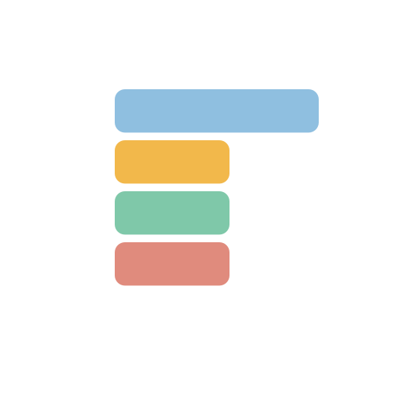

<div align="center">



# Tabbin

**A lightweight hover-activated dock for your notes — always on top, never in the way.**

[Features](#features) • [Getting started](#getting-started) • [Development](#development) • [Build](#build)

</div>

## Overview

Tabbin is a lightweight, hover-activated workspace for organizing quick notes without interrupting your workflow. The dock stays on the edge of your primary display, auto-hiding until you hover to reveal it. Notes open in native-resizable windows with rich-text editing, drag-to-reorder tabs, and per-note pinning.

> [!IMPORTANT]
> This is a private beta (v1.0.0-beta.1) published by Vanz15 for private testing. The Settings window was removed for reliability — dock behavior uses safe defaults and persisted configuration internally.

## Features

- **Transparent auto-hide dock** — frame-less, transparent overlay that hides on the screen edge and reveals on hover (12px hot zone)
- **Always-on-top** — dock remains above fullscreen and maximized windows via `setAlwaysOnTop(true, 'screen-saver')`
- **Fullscreen suppression prevention** — dock remains accessible in fullscreen via `setFullScreenable(false)`
- **Colored note tabs** — each note gets a distinct color from a 6-color palette (`#f5c542`, `#66d9c7`, `#ff8b8b`, `#a98bff`, `#76b7ff`, `#f29b72`)
- **Rich-text editing** — contenteditable editor with bold, italic, underline, strikethrough, bullet/numbered lists, indent/outdent, alignment, and format block controls
- **Drag-to-reorder** — rearrange note tabs by dragging within the dock
- **Native-resizable windows** — note windows remember their dimensions across sessions
- **Per-note pinning** — toggle individual notes to stay always-on-top via `notes:toggle-always-on-top` IPC
- **Invisible scrollbars** — scrollbar width set to 0 for clean UI
- **Single-instance** — only one Tabbin instance runs at a time; relaunching focuses the existing instance
- **Auto-updates** — built-in update checker with GitHub releases (opt-in download)
- **Portable & installer builds** — NSIS installer for Windows, DMG/ZIP for macOS

## Getting started

### Download

Pre-built binaries are available for Windows (x64):

- **`Tabbin-Portable.exe`** — portable build, no installation required
- **`Tabbin-Setup.exe`** — installer with Start Menu and Desktop shortcuts, configurable installation directory

### Running

1. Launch the executable
2. A loading screen appears with the Tabbin logo (~900ms), then fades to the dock
3. The dock docks on the **left edge** of your primary display (right-edge docking is supported internally via config)
4. **Hover a colored tab** (42px wide) to expand it to 300px and preview content
5. **Click a tab** to open a full note window
6. Move the mouse outside the dock for 400ms to auto-hide
7. Use the **New note** button to create a new note, the **Hide dock** button to manually hide the dock, or the **Exit Tabbin** button to quit

Default notes created on first run:
- **Welcome to Tabbin** — hover/click instructions (yellow tab)
- **Ideas** — capture quick thoughts (teal tab)
- **Today** — daily task list (pink tab)

## Feedback & Support

I'd love to hear your thoughts and experiences with Tabbin! Here are several ways to connect:

- 🐞 **Bug reports & feature requests:** [Open an issue](https://github.com/Vanz15/tabbin/issues)
- 💬 **General feedback:** [Share your thoughts](https://github.com/Vanz15/tabbin/issues/new/choose)
- 📧 **Direct contact:** Email [vanz15@users.noreply.github.com](mailto:vanz15@users.noreply.github.com)
- 💼 **Connect with me:** [LinkedIn @ahpmartinez](https://www.linkedin.com/in/ahpmartinez/)
- 📸 **Behind the scenes & updates:** [@ibaaannn__ on Instagram](https://www.instagram.com/ibaaannn__/)

### When reporting issues, please include:
- Windows version (run `winver` to check)
- What you were doing when the issue occurred
- Whether the dock appeared in fullscreen apps
- Screenshot if visual bug

Thank you for helping improve Tabbin! 🎯

## Development

### Prerequisites

- [Node.js](https://nodejs.org/) v18 or later
- [npm](https://www.npmjs.com/)
- [Electron](https://www.electronjs.org/) v32.3.3 (installed automatically via devDependencies)

### Setup

```bash
# Install dependencies
npm install

# Start in development mode (with hot reload)
npm start
```

The project includes `electron-reload` for development. Changes to source files in the `source/` directory trigger an automatic restart of the Electron process.

### Testing

```bash
npm test
```

This runs both test suites:
- `test_sticky_dock.js` — verifies dock behavior (always-on-top, fullscreenable, auto-hide), IPC bridge, and beta packaging configuration
- `test_v2_features.js` — verifies rich-text editor commands, drag reorder, transparent dock, native-resizable notes, per-note pinning, and installer configuration

## Build

```bash
# Build for all platforms (Windows + macOS)
npm run build:all

# Windows only (portable + NSIS installer)
npm run build:win

# macOS only (DMG + ZIP)
npm run build:mac

# Package as directory (for debugging, no installer)
npm run build:dir
```

Build artifacts are output to the `dist/` directory.

> [!NOTE]
> The installer does not include code signing. The uninstaller prompts whether to preserve or remove notes and settings stored in the user's application-data directory.

## Architecture

Tabbin is built with **Electron 32.3.3** and uses a minimal process architecture:

| File | Role |
|------|------|
| `main.js` | Electron main process — window management, IPC handlers, note storage, edge-hover detection, auto-update setup |
| `preload.js` | Context bridge exposing `window.tabbin` API to renderer processes (context isolation enabled, no nodeIntegration) |
| `dock.html` | Dock renderer — transparent overlay with note tabs, search, hide button, and quit button |
| `note.html` | Note editor renderer — contenteditable with rich-text toolbar and per-note pin toggle |
| `loading.html` | Splash screen with animated logo and "Starting Tabbin" indicator |
| `icon.ico` / `icon.png` | Application icons for Windows and macOS |

### IPC API (exposed via preload.js)

| Method | Description |
|--------|-------------|
| `tabbin.list()` | List all notes sorted by last updated |
| `tabbin.get(id)` | Get a specific note |
| `tabbin.create()` | Create a new note (opens window automatically) |
| `tabbin.update(note)` | Update note title/content/color |
| `tabbin.reorder(ids)` | Reorder notes by drag-and-drop |
| `tabbin.remove(id)` | Delete a note |
| `tabbin.open(id)` | Open a note window |
| `tabbin.hide()` | Hide the dock |
| `tabbin.cursorLeft()` | Trigger dock hide timer |
| `tabbin.quit()` | Quit the application |
| `tabbin.config()` | Get dock configuration |
| `tabbin.toggleNoteAlwaysOnTop(id)` | Toggle per-note pinning |
| `tabbin.checkForUpdates()` | Check for app updates |
| `tabbin.downloadUpdate()` | Download available update |
| `tabbin.installUpdate()` | Install update and restart |
| `tabbin.onChanged(cb)` | Listen for note changes |
| `tabbin.onConfigChanged(cb)` | Listen for config changes |
| `tabbin.onUpdate(chan, cb)` | Listen for update events |

### Data storage

- `config.json` — dock edge, edge hover toggle, note window dimensions
- `notes.json` — note data (id, title, content, color, alwaysOnTop, updatedAt)

Both stored in the Electron user data directory (`app.getPath('userData')`).

## Acknowledgements

- [Electron](https://www.electronjs.org/) — cross-platform desktop app framework
- [electron-builder](https://www.electron.build/) — packaging and installation
- [electron-updater](https://www.electron.build/variables-configuration#configurationpublishconfig) — auto-updating
- [electron-reload](https://github.com/SimulatedGREG/electron-reload) — live reload during development
