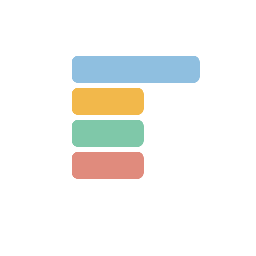

<div align="center">



# Tabbin

**A lightweight hover-activated dock for your notes — always on top, never in the way.**

[Features](#features) • [Getting started](#getting-started) • [Development](#development) • [Architecture](#architecture)

</div>

## Overview

Tabbin is a hover-activated dock for quick notes that stays out of your way. It
parks on the edge of your primary display and hides itself until you reach for
it. Notes open in native-resizable windows with rich-text editing. Drag one out
of the dock to open it where you drop it, or drag around inside the dock to
reorder.

> [!NOTE]
> **v2.2.3** fixes your note order resetting on restart, a lost note when creating
> one during a save, and an internal error on every drag-out. **v2.2.2** added
> editor keyboard shortcuts — align, strikethrough, indent, and automatic lists —
> and fixed the Save location row so it shows the folder your notes are actually
> in. **v2.2.1** brought back the classic coloured-note look and lets you drag a
> note out of the dock to open it. **v1.0.1** remains available on the releases
> page if you prefer the older tab-based dock.

## Features

- **Two dock appearances** — classic (coloured tiles that expand on hover) or glass (the same cards floating without a panel behind them)
- **Drag a note out to open it** — pull a tile off the dock and it opens where you drop it; drag around inside the dock to reorder instead
- **Settings panel** — dock side, appearance, auto-hide, dock width, launch-on-startup, save location, and clear-all-notes, behind one menu
- **Find your notes** — Settings shows the folder your notes live in, with one button to open it and another to move them
- **Right-edge docking** — the layout mirrors, so notes grow away from the edge and the header aligns to it
- **Content-sized dock** — sized to the notes it shows and centred vertically, rather than filling the screen
- **Concise header** — search, add, and menu; search expands in place when you want it
- **Note windows match the dock** — classic opens a solid sheet of the note colour with dark text, glass keeps the dark window
- **Bundled Geist typeface** — no CDN fetch at runtime, so the UI renders identically offline
- **Always on top** — stays above fullscreen and maximized windows via `setAlwaysOnTop(true, 'screen-saver')`, and `setFullScreenable(false)` keeps it reachable inside fullscreen apps
- **Rich-text editing** — bold, italic, underline, strikethrough, lists, indent/outdent, alignment, and format blocks, with the toolbar reflecting the caret's current formatting
- **Keyboard shortcuts** — `Ctrl+L` / `Ctrl+E` / `Ctrl+R` to align, `Ctrl+Alt+S` for strikethrough, `Tab` and `Shift+Tab` to indent and outdent inside a list, and automatic lists when you type `1. ` or `- `
- **Native-resizable windows** — note windows remember their size across sessions
- **Per-note pinning** — keep an individual note above other windows, with a per-note colour drawn from a five-tone palette
- **Single instance** — relaunching focuses the running dock instead of starting a second copy
- **Auto-updates** — checks GitHub releases at launch, every 6 hours, and on system resume; downloads in the background and installs when you quit
- **Portable and installer builds** — NSIS installer for Windows, DMG/ZIP for macOS

## Getting started

### Download

Pre-built binaries for Windows (x64) are on the [releases page](https://github.com/Vanz15/tabbin/releases):

| Build | Use it when |
|---|---|
| **`Tabbin-Setup.exe`** | You want auto-updates. Installs with Start Menu and Desktop shortcuts. |
| **`Tabbin-Portable.exe`** | You want no installation. Cannot self-update — it runs from a temp folder and replaces nothing. |

### Using it

1. Launch the executable. A splash screen (~900ms) fades to the dock.
2. **Hover the screen edge** to bring the dock out.
3. The header holds three icons: **search**, **add**, and **menu**. Search
   expands in place; click the magnifier again or press `Escape` to close it.
4. The **menu** opens Settings, Hide dock, and Exit.
5. **Click a card** to open the full note window, or **drag it out of the dock**
   and release to open it wherever you drop it. Dragging *within* the dock
   reorders instead.
6. Move the pointer away and the dock hides after 400ms.

First run creates three notes: **Welcome to Tabbin** (instructions), **Ideas**,
and **Today** (a task list).

The dock shows six tiles in classic mode, or four cards in glass, and scrolls
beyond that. It is sized to fit and centred vertically, so switching appearance
does not change its height much.

Everything above is adjustable from the menu: dock side, appearance, auto-hide,
dock width (**compact** 268px, the default, or **roomy** 320px), launch-on-startup,
save location, and clearing all notes.

The dock's bottom status row reports update state — available, download
progress, restart to install, or a retry option after a failure. It stays
hidden when there is nothing to report.

## Development

### Prerequisites

Node.js 18+ and npm. Electron 32.3.3 installs itself via devDependencies.

```bash
npm install
npm start
```

### Tests

```bash
npm test
```

| Suite | Covers |
|---|---|
| `test_sticky_dock.js` | Dock behavior, reduced IPC bridge, packaging config |
| `test_v2_features.js` | Rich-text commands, drag reorder, resizing, pinning, installer config |
| `test_updater.js` | Update state machine transitions, rejected events, portable guard, renderer wiring |
| `test_release_body_checksums.js` | Release-body checksum guard across stale, malformed, truncated and CRLF cases |
| `test_editor_repaint.js` | Editor repaint guards — echo writes nothing, real changes apply |
| `test_palette_migration.js` | Legacy colour mapping, idempotence, unparseable values |
| `test_save_location.js` | Save folder resolution, validation, and note migration |

These run on plain Node with no dependencies. Many assert on the *text* of
source files, which catches regressions but is not behavioral coverage. Two
suites genuinely execute code: `updater-state.js` is a pure module and the
checksum guard is imported directly.

`test_v2_features.js` also parses the dock renderer and checks stylesheet brace
balance, markup nesting, and settings-row structure. Those guards exist because
a dropped brace or a missing `</div>` renders an empty dock or a sideways
settings panel while every content assertion still passes.

### Verifying a release

```bash
npm run verify:feed
```

Release-time only, and needs network access. It confirms that:

- the published `latest.yml` declares the version the tag claims
- every file it references is attached to the release
- declared sizes and SHA-512 digests match the stored artifacts
- any SHA-256 advertised in the **release body** matches GitHub's per-asset digest

> [!IMPORTANT]
> Take checksums for the release body from GitHub's asset digests *after*
> publishing, never from a local `dist/`. `electron-builder --publish always`
> rebuilds before uploading, so the bytes that reach GitHub differ from the
> ones on disk. v1.0.0, v1.0.1 and v1.0.2 all shipped stale checksums before
> this was caught.

Upload the feed **last**, and do not replace assets on a published release.

## Architecture

| File | Role |
|---|---|
| `main.js` | Main process — windows, IPC handlers, note storage, edge-hover detection, drag-out drop resolution, crash handlers |
| `updater.js` | Update wiring — electron-updater events, build guards, re-check cadence, file logging |
| `updater-state.js` | Pure update state machine (no Electron imports), so transitions are unit testable |
| `preload.js` | Context bridge exposing `window.tabbin`; context isolation on, `nodeIntegration` off |
| `dock.html` | Dock renderer — transparent overlay, note cards, header, overflow menu, settings panel, update row |
| `note.html` | Note editor — contenteditable with rich-text toolbar and pin toggle |
| `loading.html` | Splash screen |
| `scripts/verify-feed.js` | Release-time feed and checksum verification |
| `icon.ico` / `icon.png` | Application icons |

### Update flow

`updater.js` owns a state machine and pushes a full snapshot to the dock on
every transition, which the dock both subscribes to and pulls on load. A
snapshot rather than an event stream, so an update found before the dock
finishes loading is not lost.

States resolve to one dock row: `available` → `downloading` → `ready`, plus
`error` (retryable) and `unsupported`. `install()` refuses to run for a portable
build or an unpackaged dev run, so a test can never replace a real install.

### IPC API

| Method | Description |
|---|---|
| `list()` / `get(id)` | Read notes, newest first |
| `create()` | Create a note and open its window |
| `update(note)` | Save title, content, color, pinning |
| `reorder(ids)` | Persist drag-and-drop order |
| `remove(id)` | Delete a note |
| `open(id)` | Open a note window |
| `dropNote(id)` | A tile drag finished — the main process opens the note if the cursor is off the dock, and does nothing if it was a reorder |
| `hide()` / `cursorLeft()` | Hide the dock, or arm its hide timer |
| `reportContentHeight(h)` | Tell the main process how tall the note list is, so the window can hug and centre it |
| `quit()` | Quit the app |
| `config()` / `setConfig(patch)` | Read or change dock configuration |
| `pickFolder()` | Choose a save location |
| `clear(confirm)` | Delete every note |
| `toggleNoteAlwaysOnTop(id)` | Pin a note |
| `updateStatus()` | Current update snapshot |
| `checkForUpdates()` / `downloadUpdate()` / `installUpdate()` | Drive an update |
| `dismissUpdateNudge()` | Dismiss the portable-build notice |
| `onChanged(cb)` / `onConfigChanged(cb)` / `onUpdateState(cb)` | Subscribe to changes |

### Data storage

Stored in the Electron user data directory (`app.getPath('userData')`):

| File | Contents |
|---|---|
| `notes.json` | Notes — id, title, content, color, pinning, timestamp |
| `config.json` | Dock `edge` (left/right), `dockBg` (classic/glass), `dockWidth` (compact/roomy), `edgeHover`, `launchOnStartup`, `saveLocation`, note window `noteWidth`/`noteHeight` |
| `update-state.json` | Last check timestamp, portable-notice dismissal |
| `update.log` | Updater diagnostics, since packaged Windows builds discard stdout |
| `crash.log` | Uncaught exceptions and unhandled rejections |

Notes are written atomically with a backup rollback and serialized through a
write queue, so concurrent saves cannot lose data.

A `dockBg` written by 2.1.0 or earlier is migrated on first launch rather than
reset, so upgrading never costs you your chosen appearance: `clear` becomes
`classic`, and both `bare` and `glass` become `glass`.

### Build

```bash
npm run build:win    # Windows: portable + NSIS installer
npm run build:mac    # macOS: DMG + ZIP
npm run build:all    # both
npm run build:dir    # unpacked directory, for debugging
```

Output lands in `dist/`.

> [!NOTE]
> Builds are not code signed, so Windows SmartScreen may warn on install or
> update. Signing is planned for a future release.

## Acknowledgements

- [Electron](https://www.electronjs.org/) — cross-platform desktop framework
- [electron-builder](https://www.electron.build/) — packaging and installation
- [electron-updater](https://www.electron.build/auto-update.html) — auto-updating
